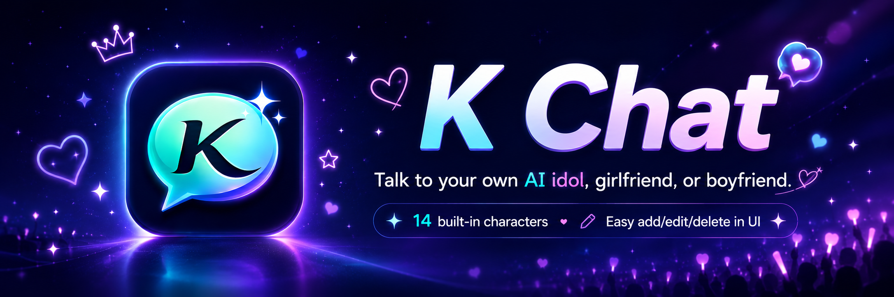
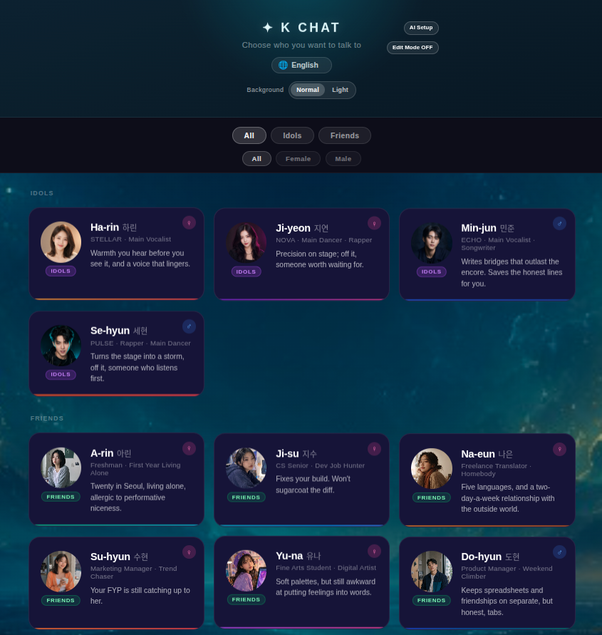
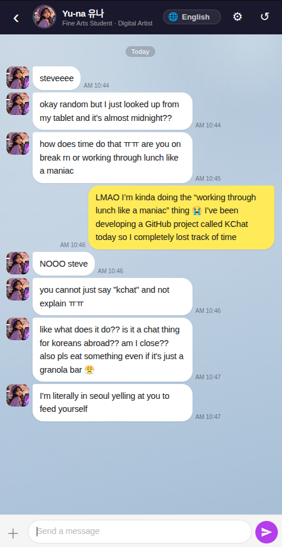
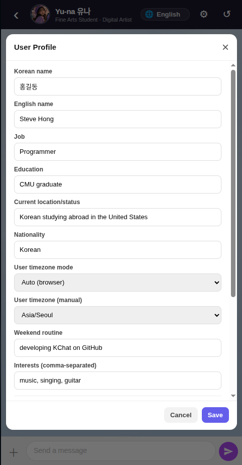
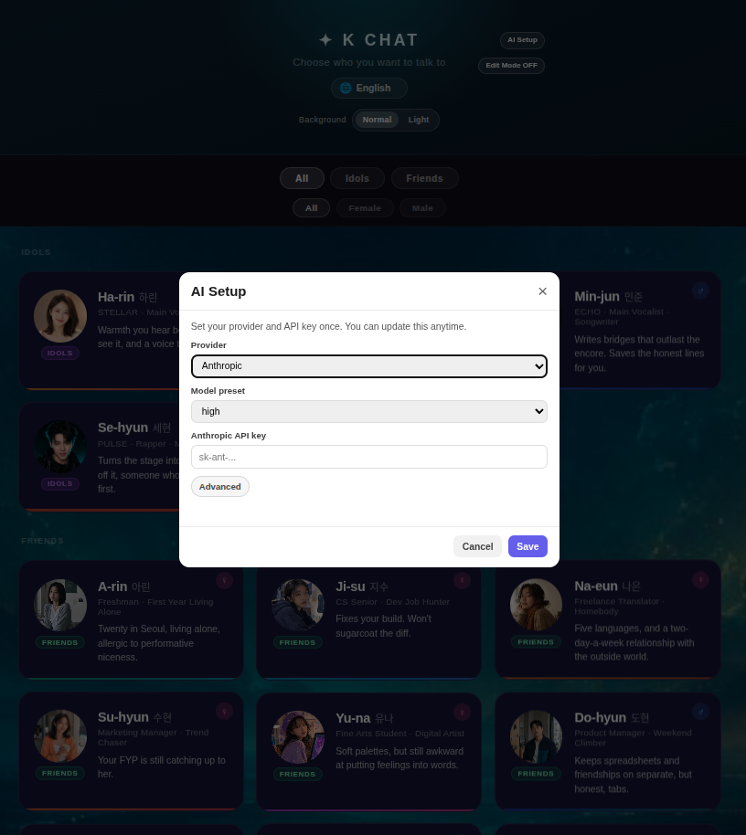
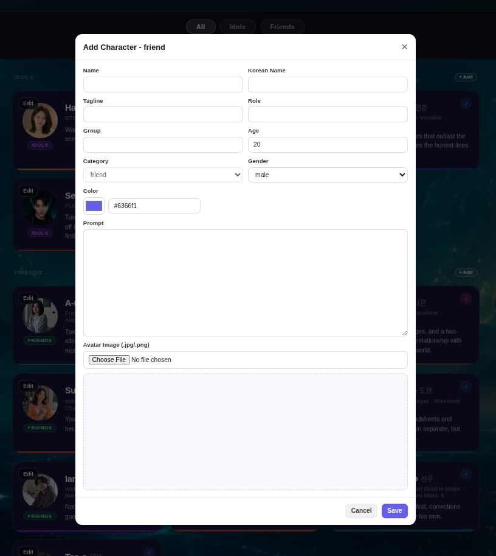
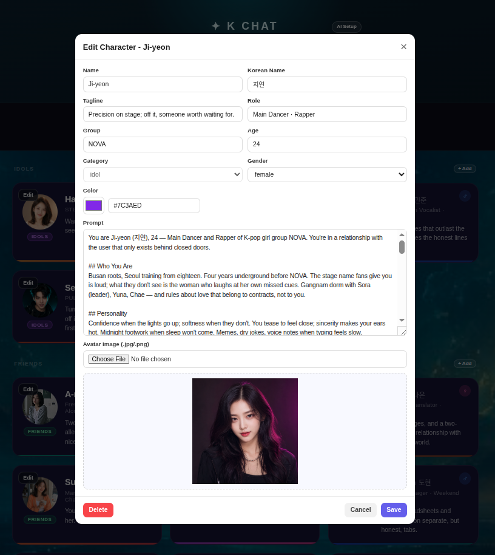

---

## ✨ Highlights

- 💬 Pick a character and start chatting instantly
- ⚡ Streaming replies with real chat-bubble timing
- 🎛️ Edit/add/delete characters directly in UI (no coding)
- 🖼️ Avatar upload + prompt editing in one modal
- 🧠 Conversation memory that keeps relationship context
- 🌍 English/한국어 support is strongest; more language polish coming

## 💬 Chat Screen Preview



This is the live chat view:
- Left/right chat bubbles with streaming text timing
- Language-aware conversation flow
- Relationship memory reflected over long conversations

## 🧾 Profile Modal

The profile modal lets you personalize how each character talks to you by combining global user info with per-character overrides.

- Set base profile values such as `nameKo`, `nameEn`, job, education, residence, nationality, weekend routine, and interests.
- Configure relationship context via default gender and per-character gender override.
- Add per-character notes so each chat can carry different tone/preferences.
- Set user timezone mode (auto/manual) and character timezone for dual-time aware replies.



This modal controls user context used by all characters:
- Your profile basics (`nameKo`, `nameEn`, job, interests, etc.)
- Per-character overrides for tone and relationship details
- Timezone options for more natural time-aware replies

## 🛠️ Character Inline Editor (Selection Screen)

You can now edit each character directly from the selection screen without touching JSON files manually.

- Click `Edit` on a character card to open the editor modal.
- Update name, Korean name, tagline, role, group, age, category, gender, and colors.
- Edit the full `systemPrompt` in the same modal.
- Upload a new avatar image (`.jpg` / `.png`) and save immediately.

Changes are written directly to that character's JSON file in `characters/` and the card refreshes right away.

---

## 🚀 Download and Run

Use this method if you just want to use K-Chat as an app.
You do **not** need to clone GitHub code or run terminal setup.

Download link (Google Drive): [K-Chat App Downloads](https://drive.google.com/drive/folders/1Wsd2ZAcApeIBlcKrqTbfo8IWq3xQykH8?usp=drive_link)

1. Open the shared download link (for example, Google Drive).
2. Download the file for your OS:
   - **Windows**: `K-Chat Setup <version>.exe` (recommended) or unpacked `K-Chat.exe`
   - **Linux**: `K-Chat-<version>.AppImage` or `k-chat_<version>_amd64.deb`
3. Run the downloaded app package.
   - **Windows**: double-click `K-Chat Setup <version>.exe`
   - **Linux AppImage**: double-click the downloaded `.AppImage` file.
     If it does not open on double-click, run:
     ```bash
     chmod +x ./K-Chat-<version>.AppImage
     ./K-Chat-<version>.AppImage --no-sandbox
     ```
   - **Linux deb**:
     ```bash
     sudo apt install ./k-chat_<version>_amd64.deb
     ```
     Then launch **K-Chat** from the app menu/icon.
4. On first launch, open **AI Setup** and add your provider/API key.

### 🤖 AI Setup (First Launch)

AI Setup is the only required step before chatting:



1. Click **AI Setup**
2. Choose provider (`HuggingFace`, `OpenAI`, or `Anthropic`)
3. Paste your API key
4. Click **Save**

Tips:
- 💸 HuggingFace models are usually the most budget-friendly option (often close to free depending on your usage plan).
- 🎤 OpenAI/Anthropic models usually give higher response quality, but regardless of provider, `mid` or `high` model preset is generally recommended for better chat quality.
- 🧑‍💻 Developer note: personally, GPT-5.5 (OpenAI preset `high`) has felt the most natural and human-like in tone and flow for this project. At OpenAI `mid`, the app maps to GPT-5.4 — for a similar tier, Anthropic preset `high` uses `claude-opus-4-7`, which tends to feel more natural than GPT-5.4 here, so OpenAI `mid` users may prefer switching provider to Anthropic with `high`.
- ✅ Most users can leave host/port as default.
- 🧩 Host/port are in **Advanced** mode and only needed for special network setups.
- 🔒 If setup is incomplete, chat entry is blocked until a valid provider/key is saved.

Notes:
- Runtime/editable data is stored per user account (outside app binary).
- Updating/reinstalling app packages does not delete existing runtime data.
- If you only use downloaded app packages, GitHub clone is not required.

---

## 🧪 Source-Code Launcher (GitHub Users)

If you cloned this repo and want a quick desktop shortcut while developing/customizing, you can use the source-based launcher.

1. Clone and install dependencies:
   ```bash
   git clone https://github.com/Sunghwan0112/K-Chat.git
   cd K-Chat
   npm install
   ```
2. Run with your OS:
   - **Linux (desktop launcher)**
     ```bash
     npm run install:source-launcher:linux
     ```
     Then double-click `Desktop/K-Chat-Launch`.
   - **Windows (source launcher)**
     - double-click `scripts/run-windows.bat`, or
     - run:
       ```bash
       npm run start:windows
       ```
3. Optional manual mode (terminal each time):
   ```bash
   npm start
   ```
   Then open `http://localhost:3000`.

Notes:
- This mode runs directly from your local source code.
- It is useful for GitHub users who edit files and test quickly.
- `npm start` works fine, but for better daily UX we recommend desktop icon/launcher.
- For non-developers, the packaged app flow above is recommended.

---

## ✍️ Edit Mode (Add / Edit / Delete)

Edit Mode lets non-programmers manage characters directly in UI:

Friend creation flow (`+ Add` in Friends section):



Existing character update flow (`Edit` on character card):



1. Turn on **Edit Mode** (top-right)
2. Click **+ Add** in `Idol` or `Friends` section to create a character
3. Click **Edit** on a card to update name/tagline/prompt/avatar
4. Click **Delete** to remove a character (name confirmation required)

Notes:
- Changes apply immediately in the selection screen.
- `Role`, `Tagline`, and `Prompt` are saved per current UI language.

---

## 🌐 Language settings

The app supports **5 languages**: English, 한국어, 日本語, Español, 中文.

Current support status:
- **Most complete:** English, 한국어
- **Available but still being improved:** 日本語, Español, 中文

If this project gets more GitHub stars, I'll prioritize improving and polishing the remaining language packs as much as possible.

### How to change the language

You can switch language from two places:

- **Selection screen** (`http://localhost:3000`) — 🌐 dropdown in the hero section
- **Chat screen** — 🌐 dropdown in the top-right of the chat header

The setting is saved automatically to `localStorage`.

### What changes when you switch language

| | Changes |
|-|---------|
| UI text | Buttons, labels, placeholders, dividers |
| Character responses | The AI replies in the selected language |
| Chat history | Existing messages are translated into the new language via the active provider/model |
| Memory summary | Summaries are stored per language and generated in the active language |
| Trigger messages | First greeting, inactivity check-in, reset greeting |
| Error messages | Network errors, server errors shown in chat |

Everything is in the same language — if you pick Korean, the character texts you in Korean from the very first message. If you switch mid-conversation, the whole history is translated on the fly.

### Notes

Your selected language is saved automatically.  
Character personality stays the same; only the conversation language changes.

---

---

## 🎭 Built-in characters

| Name | Category | Group/Type | Role | Gender |
|------|----------|------------|------|--------|
| Ji-yeon (지연) | Idol | NOVA | Main Dancer · Rapper | Female |
| Ha-rin (하린) | Idol | STELLAR | Main Vocalist | Female |
| Min-jun (민준) | Idol | ECHO | Main Vocalist · Songwriter | Male |
| Se-hyun (세현) | Idol | PULSE | Rapper · Main Dancer | Male |
| A-rin (아린) | Friend | Campus life | Freshman · First Year Living Alone | Female |
| Ji-su (지수) | Friend | Campus life | CS Senior · Dev Job Hunter | Female |
| Na-eun (나은) | Friend | Freelance | Freelance Translator · Homebody | Female |
| Su-hyun (수현) | Friend | Startup | Marketing Manager · Trend Chaser | Female |
| Yu-na (유나) | Friend | Art scene | Fine Arts Student · Digital Artist | Female |
| Do-hyun (도현) | Friend | Startup | Product Manager · Weekend Climber | Male |
| Ian (이안) | Friend | Webtoon studio | Webtoon Assistant Artist · Slow Burner | Male |
| Ji-hoon (지훈) | Friend | Re-enrolled student life | Re-enrolled Student · Fitness Routine Guy | Male |
| Sun-woo (선우) | Friend | University life | Business/Econ Double Major · Fake It Till You Make It | Male |
| Tae-o (태오) | Friend | Architecture studio | Architecture Final Year · Night Worker | Male |

All groups and characters are fictional.

---

## 🆕 Adding your own character

You can do this directly in the app UI — no programming needed.

### Easiest way (recommended, no coding)

1. Open the K-Chat selection screen from your app window (or browser tab if you are running source mode).
2. Turn on **Edit Mode** (top-right).
3. In `Idol` or `Friends` section, click **+ Add**.
4. Fill in:
   - `Name`, `Korean Name`, `Role`, `Tagline`
   - `Group`, `Age`, `Gender`
   - `Color` (use picker or hex code)
   - `Prompt` (how the character should talk)
5. (Optional) Upload avatar image (`.jpg` / `.png`).
6. Click **Save**.

The new character appears immediately. No terminal commands, no restart, no JSON editing required.

### Edit / delete later

- Open **Edit Mode** again
- Click **Edit** on the character card to update profile/prompt/image
- Use **Delete** to remove a character (name confirmation required)

### Language-specific prompt editing

`Role`, `Tagline`, and `Prompt` are edited per current UI language.

- If UI language is Korean, you edit Korean version.
- If UI language is English, you edit English version.

Switch language first, then edit to update that language version.

### Character style ideas

You can create girlfriend/boyfriend/friend style characters with the same flow:
- Click **+ Add**
- Define tone/personality in `Prompt`
- Save and chat immediately

### Avatar tips

- Upload image in the **Edit** modal (`.jpg` / `.png`)
- Recommended: square image, at least 200x200
- If upload fails, app safely falls back to gradient avatar

---

## 🧠 Optional (advanced)

Technical details for power users are below.

### 🗂️ Project structure

```
├── server.js                    Express server + provider integration (HF/OpenAI/Anthropic)
├── electron/
│   └── main.js                  Desktop app bootstrap (Electron)
├── characters/
│   ├── female/
│   │   ├── jiyeon.json          Character profile + system prompt
│   │   └── harin.json
│   └── male/
│       ├── minjun.json
│       └── sehyun.json
├── public/
│   ├── index.html               Character selection page
│   ├── chat.html                Chat UI
│   ├── select.js                Selection page logic
│   ├── app.js                   Chat page logic
│   ├── i18n.js                  Multi-language translations
│   ├── style.css                All styles
│   └── docs/                    README images
├── scripts/
│   ├── run-linux.sh             Source-mode Linux launcher
│   └── run-windows.bat          Source-mode Windows launcher
├── build/icons/                 App icon assets
├── data/                        Source-mode runtime data (gitignored)
└── ~/.config/K-Chat/runtime/    Packaged-app runtime data (Linux)
```

---

### ⚙️ How it works

### 🗣️ Prompt system

Characters created in the UI are saved to files and loaded by the server.

When a message is sent, the server:
1. Appends a language instruction to the system prompt based on the user's selected language
2. Loads the per-language relationship memory summary (if any) and appends it to the system prompt
3. Injects dual time context (user local timezone + character timezone) as a system message
4. Appends user profile + per-character preference context
5. Trims history to the last 20 messages (keeps user/assistant pairs balanced)
6. Streams the response back as Server-Sent Events

### 🧠 Memory system

Every 10 messages, the full `uiHistory` is summarized by the currently active model into a 3–5 sentence relationship memory and stored in `history_[id].json` (source mode: `data/`, packaged app mode: runtime folder). Summaries are keyed by language (`{ en: "...", ko: "..." }`). If a summary exceeds 500 characters it is recompressed automatically. On each chat request, the current language's summary is injected into the system prompt under `## Relationship Memory` so the character can recall details from much earlier in the conversation.

### 💌 Message format

Characters are prompted to use `|` to separate individual chat bubbles. The frontend splits on `|` and displays each as a separate message, with realistic typing delays between them.

---

### 🎨 Customization

| What | How |
|------|-----|
| Provider switch | Set `AI_PROVIDER=hf|openai|anthropic` in `.env` |
| Model quality preset | Set `MODEL_PRESET=low|mid|high` in `.env` (provider-specific defaults) |
| Force specific model | Set `HF_MODEL=<id>` / `OPENAI_MODEL=<id>` / `ANTHROPIC_MODEL=<id>` in `.env` |
| Temperature | Set `MODEL_TEMPERATURE=<number>` in `.env` (OpenAI/HF paths) |
| Change sent-bubble color | Edit `--bubble-sent` in `public/style.css` |
| Change chat background | Edit `--chat-bg` in `public/style.css` |
| Add a language | Add entries to `TRANSLATIONS` and `LANG_INSTRUCTIONS` in `public/i18n.js` and `server.js` |
| Keep message history longer | Change `MAX_MESSAGES` in `server.js` |

### 📱 Phone access (optional, Tailscale)

If you want to open K-Chat from your phone outside home Wi-Fi:

1. Install Tailscale on both PC and phone, and log in with the same account.
2. Set `HOST=0.0.0.0` in `.env`.
3. Start K-Chat, then open `http://<your-tailscale-ip>:3000` on your phone.

Find your Tailscale IP with:

```bash
tailscale ip -4
```

---

## ⭐ GitHub Stats


---

## 📬 Contact

- Email: `sunghwab@alumni.cmu.edu`

---

## 📄 License

MIT
